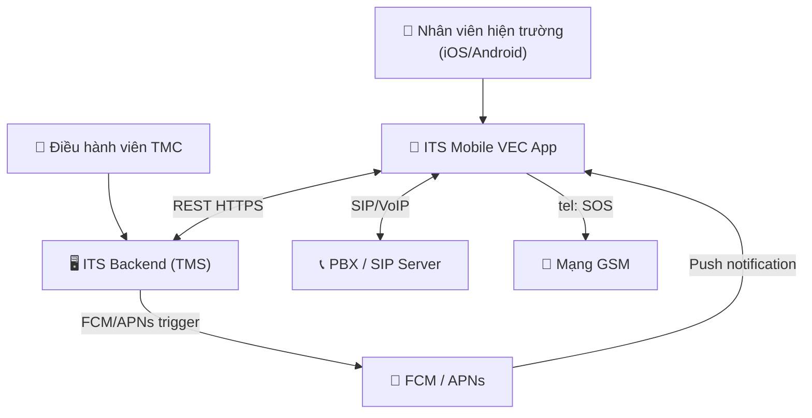

# Architecture Documentation — ITS Mobile VEC

## 1. System Architecture Overview

ITS Mobile VEC là ứng dụng di động native (React Native target) hoạt động như một client-side app kết nối với 4 hệ thống bên ngoài:

1. **ITS REST API** — nguồn dữ liệu nhiệm vụ và sự cố
2. **PBX SIP Server** — VoIP internal calls
3. **FCM/APNs** — push notifications từ TMC
4. **GSM Network** — emergency SOS calls

Không có backend riêng cho app — toàn bộ business logic nằm ở ITS Backend và PBX.

---

## 2. C4 Level 1 — System Context

Xem [architecture/context.md](architecture/context.md)



---

## 3. C4 Level 2 — Containers

Xem [architecture/containers.md](architecture/containers.md)

### Mobile App Internal Structure

| Container | Technology | Purpose |
|---|---|---|
| UI Layer | React Native + TypeScript | Screens, navigation, local state |
| Session Store | AsyncStorage | JWT token + call history |
| SIP/VoIP Client | SIP.js / react-native-voip | VoIP call management |
| Push Handler | @react-native-firebase | FCM/APNs push processing |

---

## 4. Navigation Architecture

```
App Launch
    │
    ├── [Not logged in] → LoginView
    └── [Logged in]
            │
            └── Bottom Navigation (4 tabs)
                    ├── Tab 1: Công việc (tasks)
                    │       └── [Tap task] → Chi tiết sự cố (task detail)
                    ├── Tab 2: Liên lạc (calls) [default]
                    │       ├── Sub-tab: Danh bạ (directory)
                    │       └── Sub-tab: Lịch sử (history)
                    ├── Tab 3: Thông báo (alerts)
                    └── Tab 4: Tôi (profile)

    [Always visible] → SOS FAB button (floating, z-50)
```

---

## 5. Authentication & Session

| Property | Value |
|---|---|
| Method | JWT token |
| Login credentials | Tài khoản (username) + Extension PBX (4 digits) + Mật khẩu |
| Storage | localStorage / AsyncStorage (key: `its_session_v1`) |
| Lifetime | Pending resolution of JWT TTL + refresh strategy |
| Logout | Clear localStorage → clear call history → redirect to login |

### Auth Flow

```
User → Enter [tai_khoan + extension_pbx (4 digits) + mat_khau]
  → Client validation (extension = /^\d{4}$/)
  → POST /auth/login → JWT token
  → Store in AsyncStorage
  → Navigate to /calls (default)
```

---

## 6. Key Integration Patterns

### ITS REST API
- **Auth:** JWT Bearer token from login (to confirm with VEC — GAP-002)
- **Task pull:** GET /tasks?user={me} on app open + pull-to-refresh
- **Real-time updates:** FCM data message triggers re-fetch (GAP-003 resolution: push triggers pull)
- **Status update:** PATCH /tasks/:id/status — optimistic UI + background sync
- **Media upload:** POST /tasks/:id/media (multipart/form-data, with retry)

### PBX / SIP Integration
- **Registration:** SIP REGISTER on app startup, keep-alive every 30s
- **NAT:** ICE/STUN/TURN required for mobile network NAT traversal
- **iOS:** CallKit (in-call UI) + PushKit (incoming call when backgrounded)
- **Android:** Foreground service for SIP registration keep-alive
- **Credential strategy:** Separate SIP credentials vs reuse app JWT (GAP-001 — to resolve)

### Push Notifications
- **Android:** FCM data message (silent) → app fetches notification list from backend
- **iOS:** APNs background notification → app fetches; PushKit for VoIP incoming calls
- **4 types:** PhanCong (task assigned), CapNhatTrangThai (status change), HeThong (system), TMC (dispatcher message)

---

## 7. Data Flow — Task Processing

Xem [architecture/sequences/task-processing.md](architecture/sequences/task-processing.md)

**Summary:** TMC creates task → ITS Backend pushes FCM → Field Op receives notification → Opens app → Fetches task → Updates status 1→2→3 → Uploads media → Sends report to TMC.

---

## 8. Data Flow — VoIP Call

Xem [architecture/sequences/pbx-call.md](architecture/sequences/pbx-call.md)

**Summary:** App registers SIP on startup → Field Op selects contact → SIP INVITE → RTP audio → BYE → logged.

---

## 9. Non-Functional Requirements

| NFR | Target | Architecture Impact |
|---|---|---|
| Platform | iOS + Android | React Native; platform-specific: CallKit, PushKit, FCM foreground service |
| SOS offline | 100% on GSM | `Linking.openURL('tel:...')` — native OS, no internet required |
| Task load | < 3s on 3G | Pagination, lightweight list response, local cache |
| VoIP setup | < 5s | STUN/TURN config; SIP INVITE round-trip |
| Security | HTTPS + JWT | All API calls TLS; token stored in AsyncStorage (encrypted on-device) |
| Push delivery | < 10s from TMC action | FCM/APNs reliable delivery; app handles all 3 lifecycle states |

---

## 10. Architecture Risks & Open Questions

| ID | Risk | Status |
|---|---|---|
| GAP-001 | SIP auth mechanism (separate credentials vs JWT?) | 🔴 Blocking M1-F003 |
| GAP-002 | ITS API auth mechanism | 🔴 Blocking M2-F001 |
| GAP-003 | Task update: push or poll? | 🔴 Blocking M2 real-time |
| GAP-008 | Full ITS API specification not provided | 🔴 Blocking all M2 |
| — | VoIP NAT traversal on mobile networks | 🟡 Risk |
| — | Concurrent SIP registrations ~200 users | 🟡 PBX capacity check needed |
