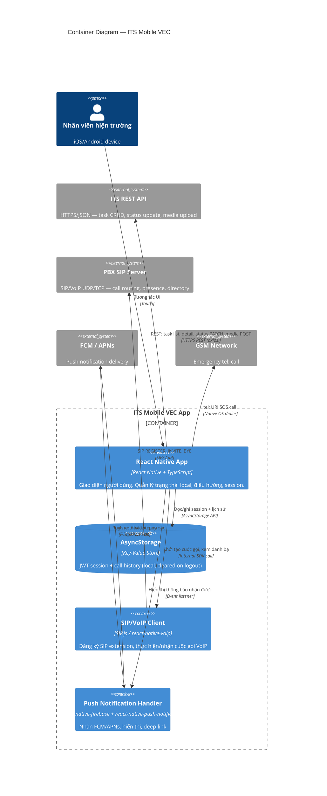

# Container Diagram — ITS Mobile VEC

## C4 Level 2: Containers

## Container Responsibilities

| Container | Technology | Responsibility |
|---|---|---|
| React Native App | React Native + TypeScript | All screens, navigation (react-navigation), state management |
| AsyncStorage | @react-native-async-storage | Session persistence across app restarts |
| SIP/VoIP Client | SIP.js / react-native-sip | SIP registration, VoIP call lifecycle, NAT traversal |
| Push Handler | @react-native-firebase/messaging | Background/foreground push, deep linking |

## Deployment Notes

| Platform | Specific Requirements |
|---|---|
| iOS | CallKit (in-call UI), PushKit (VoIP background), APNs certificate (Dev + Prod) |
| Android | FCM foreground service, CALL_PHONE permission, microphone permission |
| Both | STUN/TURN server for SIP NAT traversal on mobile networks |
