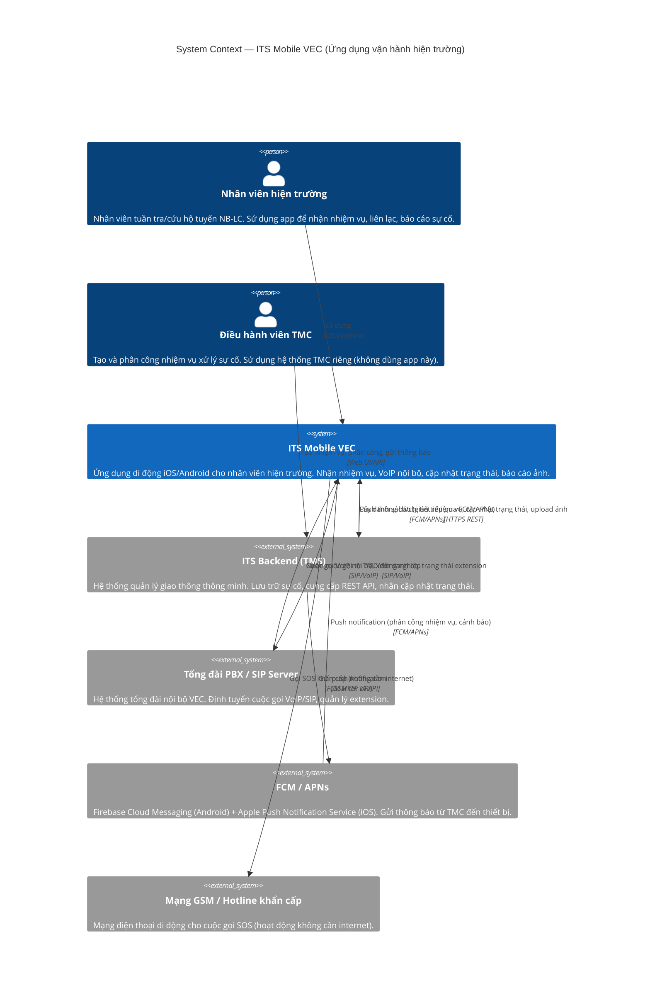

# System Context Diagram — ITS Mobile VEC

## C4 Level 1: System Context

## System Actors Summary

| Actor | Role | Uses App? |
|---|---|---|
| Nhân viên hiện trường | Primary user — nhận nhiệm vụ, liên lạc, báo cáo | ✓ (this app) |
| Điều hành viên TMC | Tạo nhiệm vụ, giám sát | ✗ (TMC system) |
| ITS Backend | Cung cấp REST API, push notification trigger | System |
| PBX/SIP Server | Định tuyến VoIP | System |
| FCM/APNs | Delivery push notification | Infrastructure |
| Mạng GSM | SOS emergency call | Infrastructure |
