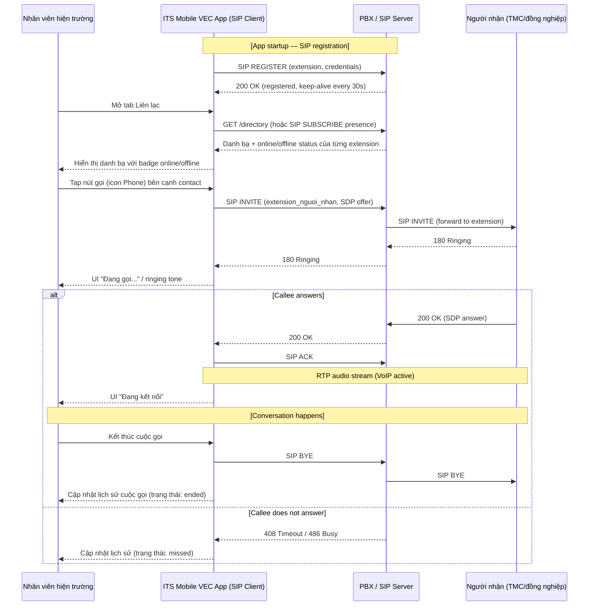

# Sequence Diagram — Cuộc gọi nội bộ PBX (VoIP Flow)

## Journey: Field Op thực hiện cuộc gọi VoIP qua PBX

## Notes

- **NAT traversal:** Mobile networks require STUN/TURN server for ICE negotiation.
- **iOS background:** CallKit + PushKit required for incoming calls when app is backgrounded/killed.
- **Android background:** Foreground service required for SIP registration keep-alive.
- **Prototype status:** Mock only — `addMockCallHistory()` writes to localStorage; no real SIP connection.
