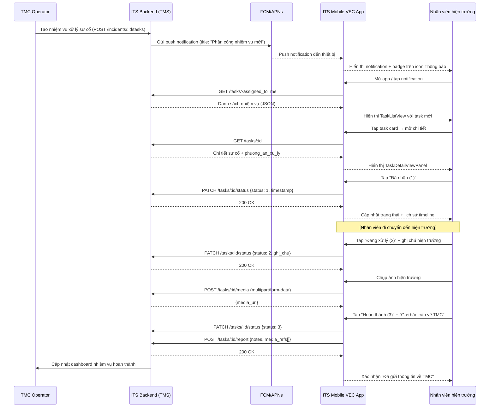

# Sequence Diagram — Xử lý sự cố (Task Processing Flow)

## Journey: Field Op nhận và xử lý nhiệm vụ sự cố

## Notes

- **Status machine (strict):** ChuaXuLy → DaNhan(1) → DangXuLy(2) → HoanThanh(3). No backward transitions.
- **Offline resilience:** Status updates should use optimistic UI + background sync queue for expressway coverage gaps.
- **SOS interrupt:** SOS FAB is accessible at any point in this flow (Z-50, fixed position).
