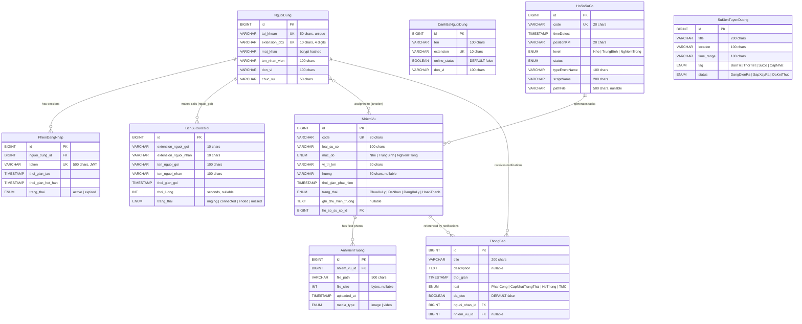

# Data Model — ITS Mobile VEC

## Entity Relationship Diagram



## Entity Catalog

### NguoiDung (User Account)
Tài khoản nhân viên hiện trường. Lưu tại ITS Backend.

| Field | Type | Constraint | Notes |
|---|---|---|---|
| tai_khoan | VARCHAR(50) | UNIQUE, NOT NULL | System username |
| extension_pbx | VARCHAR(10) | UNIQUE, NOT NULL | 4-digit PBX extension |
| mat_khau | VARCHAR(255) | NOT NULL | bcrypt hashed |
| ten_nhan_vien | VARCHAR(100) | | Full Vietnamese name |
| don_vi | VARCHAR(100) | | Work unit/team |
| chuc_vu | VARCHAR(50) | | Job title |

### PhienDangNhap (Session)
JWT session. Lưu in localStorage/AsyncStorage và server-side.

| Field | Type | Constraint | Notes |
|---|---|---|---|
| token | VARCHAR(500) | UNIQUE | JWT |
| trang_thai | ENUM | active/expired | State machine |

**State machine:** `active` → `expired` (logout hoặc TTL hết hạn)

### NhiemVu (Task/Assignment)
Nhiệm vụ xử lý sự cố được phân công. Lưu tại ITS Backend.

| Field | Type | Constraint | Notes |
|---|---|---|---|
| code | VARCHAR(20) | UNIQUE | e.g. TASK-8821 |
| loai_su_co | VARCHAR(100) | NOT NULL | Incident type |
| muc_do | ENUM | Nhe/TrungBinh/NghiemTrong | Severity |
| trang_thai | ENUM | ChuaXuLy/DaNhan/DangXuLy/HoanThanh | Status |

**State machine:**
```
ChuaXuLy → DaNhan(1) → DangXuLy(2) → HoanThanh(3)
(strict forward only, no skip, no rollback — BR-INTEL-015, 016)
```

### HoSoSuCo (Incident Profile)
Hồ sơ sự cố từ hệ thống ITS. Nguồn: ITS Backend API.

### AnhHienTruong (Field Media)
Ảnh/video do nhân viên chụp tại hiện trường. Upload lên ITS Backend.

### ThongBao (Notification)
Thông báo push. 4 loại: PhanCong, CapNhatTrangThai, HeThong, TMC.

### DanhBaNguoiDung (Directory)
Danh bạ nội bộ từ PBX. Online/offline status realtime.

### LichSuCuocGoi (Call History)
Lịch sử cuộc gọi VoIP. Source: PBX server (hoặc local device).

### SuKienTuyenDuong (Road Events)
Sự kiện trên tuyến (bảo trì, thời tiết). Nguồn: ITS Backend realtime.

## Client-side Storage

| Key | Type | Contents | Cleared |
|---|---|---|---|
| `its_session_v1` | localStorage/AsyncStorage | `{token, profile}` | On logout |
| `its_call_history_v1` | localStorage/AsyncStorage | `LichSuCuocGoi[]` | On logout |

## Data Classification

| Entity | PII fields | Sensitivity | Notes |
|---|---|---|---|
| NguoiDung | ten_nhan_vien, don_vi | Internal | No public PII |
| LichSuCuocGoi | ten_nguoi_goi/nhan, extension | Internal | Communications metadata |
| AnhHienTruong | file_path | Operational | May contain scene imagery |
| ThongBao | title, description | Operational | May contain incident details |

PII count: 0 public PII fields (no CCCD/CMND, no personal contact info).
All data is operational/internal to VEC highway operations.
