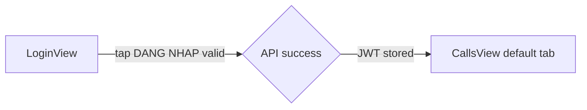
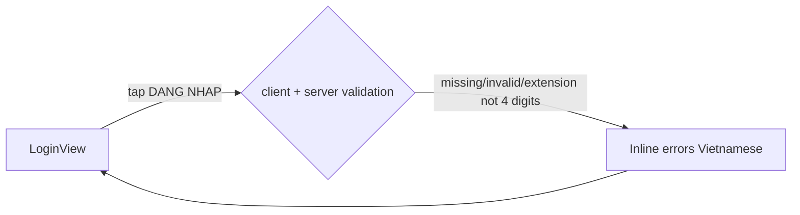
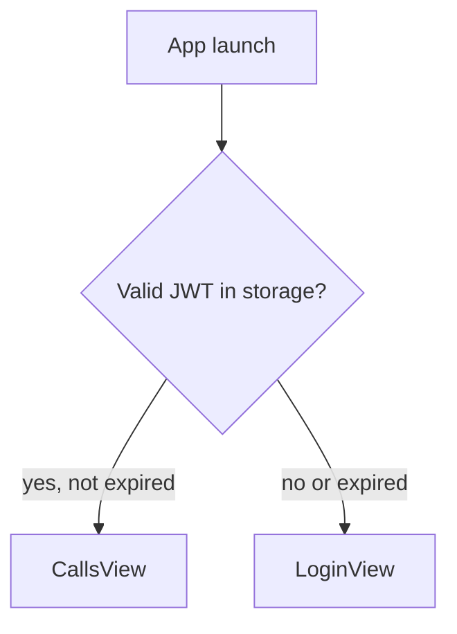
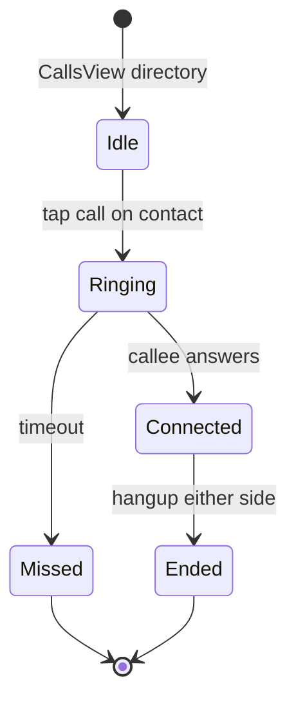
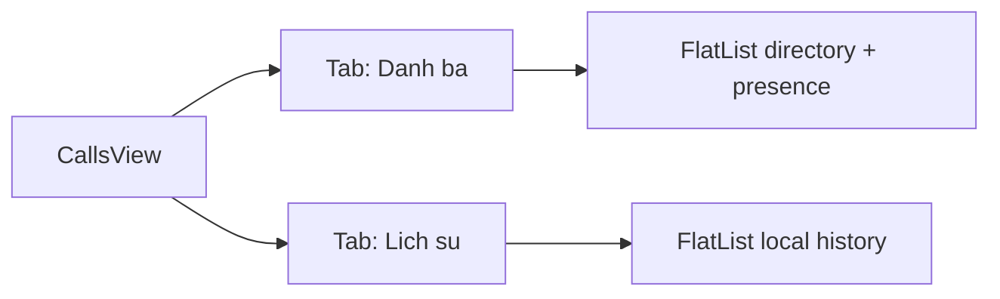
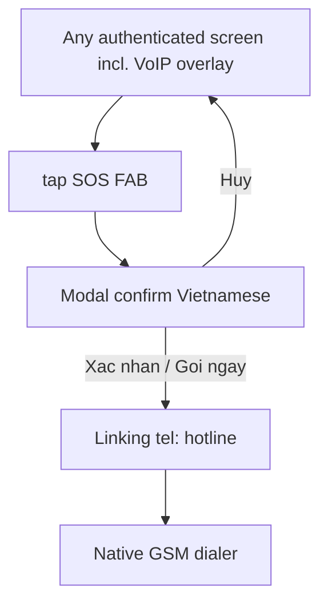
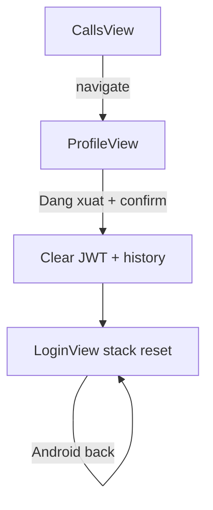

# User Flows — ITSM-20260429-001 (M1)

**Output mode:** lean  
**Platform:** React Native (iOS + Android)

---

## Flow A — Login success



---

## Flow B — Login validation failure (inline)



---

## Flow C — Session restore (bypass login)



---

## Flow D — VoIP call (directory)



---

## Flow E — CallsView: directory vs history



---

## Flow F — SOS from any authenticated screen



---

## Flow G — Profile and logout



---

## ASCII — End-to-end (condensed)

```
[App cold start]
       |
       +-- valid session --> CallsView
       |
       +-- no/expired session --> LoginView --success--> CallsView

CallsView --tab--> Directory | Call history
CallsView --call icon--> Ringing --> Connected | Missed --> history row

Any screen (auth) --SOS FAB--> Confirm --> tel:

CallsView <---> ProfileView --logout confirm--> LoginView (stack reset, no back to authed)
```

---

## UX notes for diagram consumers

| Flow | AC refs |
|---|---|
| A, B | AC-001.1, AC-001.2 |
| C | AC-002.1, AC-002.2 |
| D | AC-004.1, AC-004.2, AC-006.1 |
| E | AC-005.1, AC-006.1 |
| F | AC-007.1, AC-007.2, AC-008.1 |
| G | AC-003.1, AC-003.2, AC-009.1 |
