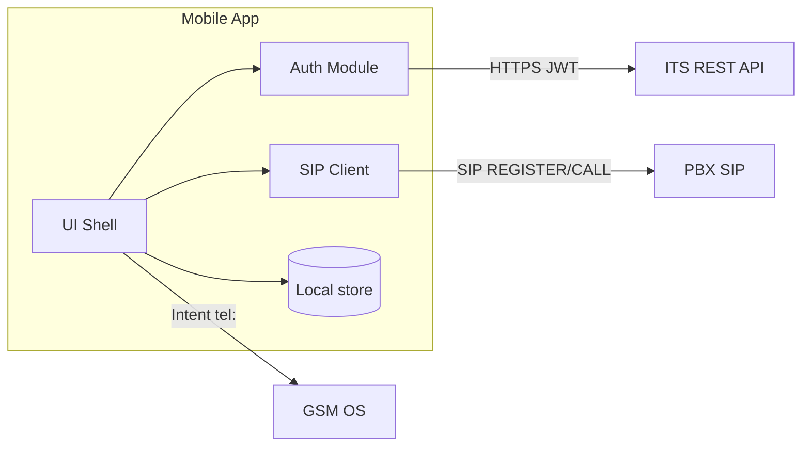

# SA — Kiến trúc giải pháp (Lean): M1 — Xác thực & Liên lạc

## 1. Context

- **Client:** React Native (iOS/Android) — **khảo sát UI hiện tại:** web demo (Vite + React) bám `designer/screens.md` & `docs/source` wireframe.
- **Backend nhận diện:** ITS (REST + JWT), PBX (SIP/RTP), GSM (OS dialer).

## 2. C4 (gói nhỏ)

## 3. GAP resolution

| ID | Quyết định kỹ thuật |
|---|---|
| GAP-001 | SIP auth **Option A**: dùng `extension_pbx` + `mat_khau` (hoặc derived credential) cho REGISTER theo chính sách PBX; **xác nhận vendor** trước go-live. |
| GAP-002 | ITS: header `Authorization: Bearer <JWT>`; refresh token **optional** sprint sau; clock skew ±60s. |
| GAP-NEW-001 | `LichSuCuocGoi.ten_nguoi_nhan`: join/extension map từ cache Danh bạ tại thời điểm kết thúc cuộc gọi; null → hiển thị số/extension. |

## 4. Dữ liệu cục bộ (M1)

- **Phien / JWT:** key-value an toàn (EncryptedStorage nếu RN policy yêu cầu).
- **LichSuCuocGoi:** SQLite hoặc tương đương; xóa khi logout.

## 5. NFR

- TLS 1.2+; không log password/token.
- SOS: không phụ thuộc mạng dữ liệu (GSM).

## 6. Viện dẫn chéo M2/M3

- Cùng **JWT ITS** cho REST task/notification.
- Push (M3): đăng ký FCM/APNs sau login; topic/user-id do ITS quản.
